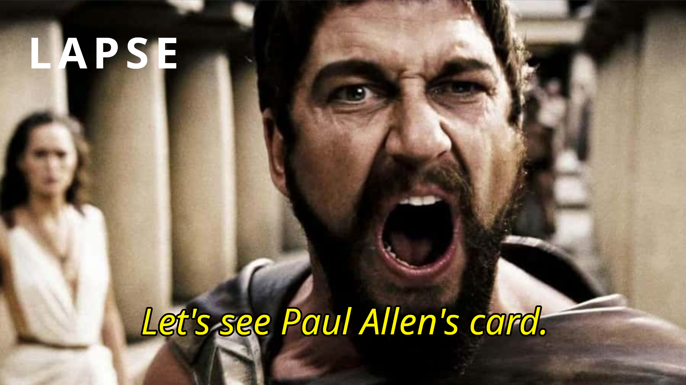

# LAPSE for Jellyfin

Subtitles that show up two seconds late, or drift further out as the film goes on, or belong to a different cut of the same movie. This plugin fixes those. It listens to the audio, works out where the speech actually is, and moves the subtitle to match.

That is the whole idea. You press Sync on an item and it sorts itself out.

This repo is just the Jellyfin plugin. The thing doing the actual alignment is a separate program called the engine, and the plugin downloads it for you on first run. Three engines are supported and you only need one.

## Getting it

Add the repository in Jellyfin under **Dashboard > Plugins > Repositories**:

```
https://raw.githubusercontent.com/rs-jensen/lapse-jellyfin-plugin/main/manifest.json
```

Then find LAPSE in the **Catalog** tab, install it, and restart Jellyfin.

Now open the plugin from **Dashboard > Plugins > LAPSE**. This part matters: a fresh install has no engine on disk and cannot sync anything yet. Download it from the **Engines** tab in the plugin dashboard, or press the Install button the dashboard shows you on a fresh install. Either way it is one download and then you are set up.

You need Jellyfin 10.11 or newer.

## Using it

Every film, episode and loose video gets two new entries in its three dot menu.

**Sync Subtitles** is the one you will use. Press it, press Sync, wait. If the item has several subtitle files it asks which one. There is an Advanced button in there too if you want to pick a different mode, translate the subtitle, or nudge the timing by hand.

**Sync All Subtitles to Reference** is for items with several subtitle tracks where one of them is already correct. Pick that one and everything else on the item gets lined up against it. Matching a subtitle against another subtitle skips the audio entirely, so it takes a second or two instead of a minute, and it is usually more accurate than syncing each track separately.

There is also a **Shift Subtitles** entry for when a sync gets close but is still a hair off. It shows you a real line from the file, a slider, and a millisecond box, and the preview updates as you drag. It does not touch the engine, so it works even before you have installed one.

## The dashboard

Opening the plugin puts you on a dashboard, not a settings form. It shows which engine is active, how much of your library is synced, and what has been synced recently. Every row in that recent list has an **Undo** button, which puts the backup back or deletes the file the run added, so a sync that moved something it should not have is one press to reverse. Everything that is really configuration is folded away under Settings, because most people set it up once and never look again.

What is behind that Settings group:

**Engines** is where you install, update and switch engines, and where each engine's Advanced section lives. More on that below.

**Libraries** has an on/off switch per library and an optional schedule with a day and a time. A library you have never touched counts as on, so an update never quietly stops syncing something.

**File output** decides what happens to the file you synced. This is the setting worth reading before you run a bulk sync.

**Ignore list** is for things you never want touched automatically. Ignoring a series or a folder covers everything inside it, and ignored items show up greyed out and struck through in the status list so you can see at a glance what is being left alone. You can still sync an ignored item by hand.

**Translation** sets up the translation providers. It is not where you start a translation job, that is on the item's Advanced dialog.

**Subtitle appearance** restyles subtitles during playback. Nothing on disk changes, so turning it off puts everything straight back.

**Experimental** holds the two features that depend on things outside Jellyfin, described further down.

Outside the Settings group there is a **Sync status** list of every syncable item with search and filters, a **Bulk sync** page for running the whole library or one folder, and **Subtitle to subtitle** for lining up two files without going through a library item at all.

## Engines

**LAPSE** is the one this plugin is built around and the one to use. It listens to the audio and works out on its own whether the subtitle is simply early, drifting because it was made for a different framerate, split across a re-cut, or some combination, then fixes whichever it is. It also says how sure it is about the answer, which none of the others do. Builds are published for Linux, macOS and Windows, so it runs wherever Jellyfin does.

**alass** splits the file into sections and times each one separately. Handy for recordings cut around ad breaks. Only x86_64 builds are published, for Linux and Windows.

**ffsubsync** shifts the whole subtitle and can correct a framerate mismatch. It also has a split mode when you give it a split penalty. Builds for Linux x86_64 and arm64, Windows x64, and macOS on Intel and Apple silicon.

If you want the actual numbers rather than my word for it, there is a [benchmark writeup](https://github.com/rs-jensen/lapse/blob/main/docs/benchmarks.md) comparing all three across 39 films picked to be hard, with timings and failure cases. The [engine repo](https://github.com/rs-jensen/lapse) has the rest of the detail.

Engines install into your Jellyfin data folder under `lapse/engines/<engine>`.

### Advanced settings per engine

Each engine card has an Advanced section, and what is in it comes from reading that engine's actual source rather than from a list of generic options. So LAPSE's Advanced has its audio track and subtitle track pickers, full scan, cache control, embedded subtitle handling and force; alass has its interval, speed optimization, encodings and framerate guessing; ffsubsync has its voice detector, max offset, golden section search and the rest. Every control says which command line flag it sets.

Each engine also gets a **Default sync mode**, which is what the Sync button in the three dot menu does with that engine. LAPSE ships on Auto, which is the mode where it decides the shape of the problem itself. The modes offered are that engine's own modes, so nothing is ever listed and greyed out.

The binary path override is in there too. Point it at a build you made yourself and the plugin will use it and never replace it, since a binary you built is not the plugin's to overwrite.

### Updates

The dashboard checks GitHub for newer engine releases every time it loads. The answer is cached for half an hour, so a page refresh does not cost you a network call. When something newer is out, the card says so and the Update button installs it. Leave auto-update on and the daily task does the same thing without asking.

If the plugin cannot tell which version is on disk, it treats that as out of date rather than up to date, so you can still update. Each card also has an Uninstall button that removes the copy the plugin downloaded and frees the disk. Your settings for that engine are kept, and a binary you pointed the path override at is never touched.

### If an engine will not start

The engine card shows the real error when a binary is installed but will not run. Usually a missing shared library. The About page lists the server architecture and the architecture this process is running as, which is worth a look if they disagree, because that means emulation and it explains a lot of otherwise baffling failures.

Manual shifting keeps working regardless, since it only rewrites timestamps.

## File output and confidence

There are four ways a sync can end up on disk:

| Mode | What happens |
|---|---|
| Write a new file | Leaves the original alone. `Movie.en.srt` becomes `Movie.en.shifted.srt`. This is the default. |
| Write a new file, keep a backup | Same, but an earlier result at that name is kept as `.bak`. |
| Overwrite, keep a backup | Replaces the subtitle, keeps the old one as `.bak`. |
| Overwrite, no backup | Replaces the subtitle and keeps nothing. |

Jellyfin picks up a new file as an extra subtitle track on its next scan, so with the sidecar modes you end up with both timings and can switch between them in the player. The `.shifted` part is configurable.

Whatever the mode, the engine writes to a temporary file first and it is only moved into place once the run finished and actually produced something. A crashed or cancelled run cannot destroy a working subtitle.

Then there is confidence, which is LAPSE only. When LAPSE finds an offset it also measures how far that answer stood out from every other offset it tried, and calls the result solid, unsure, or nothing. The threshold it judges against is the `--confidence` value, and the plugin defaults to 8, which is the engine's own internal default rather than a number invented here.

When a result comes back below that bar, the recommended thing to do with it is write it to a sidecar. A low score nearly always means the subtitle is not for this video, and sidecar is the only option where being wrong about that costs you nothing: whatever you had is still there, and the doubtful result is sitting next to it if you want to look. The other two options are throw it away, or write it anyway.

alass and ffsubsync report nothing of the kind, so none of this applies to them and their results always get written.

## Subtitle to subtitle

Point it at two subtitle files and it lines the second one up against the first. No library item involved, and no audio decoding, so it is quick.

By default the result goes in the same folder as the reference subtitle. That is the file already sitting correctly next to its video, so a result there is one Jellyfin will pick up as another track for that video. You can also put it beside the input subtitle, or in a folder you choose.

## Translation

Translation is a separate job from syncing. It never touches the engine, never modifies the file it reads, and writes its result as a new file. Run either, both, in any order.

To start one, press Advanced on an item and use the Translate box in that dialog. The Translation settings page is only where providers get configured.

Providers are MyMemory (works with no setup), self-hosted LibreTranslate and Lingarr, and DeepL and Google Cloud if you have a key. Only the dialogue is sent anywhere. Timings, cue numbers, WebVTT headers and ASS style blocks come back untouched.

Neither provider reports a confidence number, so rather than pretending otherwise the plugin scores each line on what it can see: whether anything came back, whether the text changed, whether the length is plausible, and whether the detected language matches what was asked for. Lines below the threshold are counted and optionally left in their original language.

## Experimental

Two features live behind an Experimental page because they depend on things outside Jellyfin and can break when those things change.

**Fetching from OpenSubtitles.** If you press Sync on an item that has no subtitle at all, the plugin can go and get one first, then sync it. Items that already have a subtitle are untouched. You need an API key from opensubtitles.com, and an account name and password on top of that, because their API hands out search results to a key alone but a download needs a login token. Downloads come out of that account's daily quota.

**Radarr and Sonarr.** Both apps can call a URL when they import something. The Experimental page generates one for you: paste it into a Webhook connection in Radarr or Sonarr and tick On Import, and a new episode or film gets synced as soon as Jellyfin has scanned it in.

That last part is the awkward bit and worth knowing about. Radarr fires the moment the import finishes, but Jellyfin does not know the file exists until its own scan picks it up, which can be minutes later. So the plugin does not sync the path directly. It waits for the item to appear in the library, checking with increasing gaps for up to about twenty minutes, and syncs it when it does. If it never appears, it gives up quietly and the scheduled sync catches it later. Nothing polls anything, and nothing sits running forever.

The URL carries a secret, which is the only thing protecting it, because neither app can send a Jellyfin API key. Treat it like a password. The endpoint does nothing at all until you turn it on, and the only thing a valid call can do is queue a sync for a file that is already in your library.

## Scheduled tasks

Two show up under Dashboard > Scheduled Tasks. *Sync subtitles* runs over every enabled library. *Update sync engines* checks GitHub for newer engine releases once a day.

## License

GPL v3. See [LICENSE](LICENSE).

## Credits

Built by [rs-jensen](https://github.com/rs-jensen) and [cowmuncher](https://github.com/cowmuncher).
