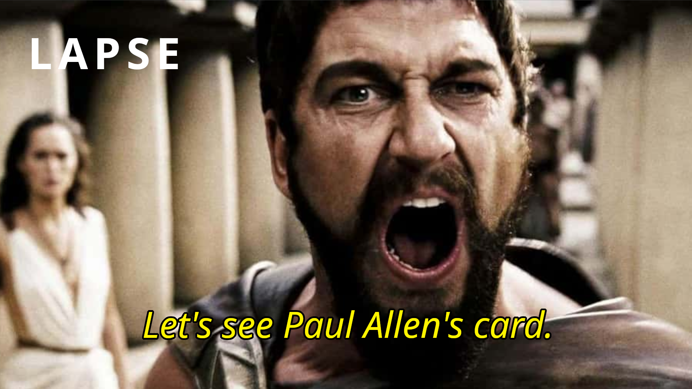

<p align="center">
  
</p>

# LAPSE for Jellyfin

Subtitles that show up late, slowly drift away from the picture, or were made for a different cut of the film. LAPSE listens to the audio, finds where people are actually talking, and moves the subtitle to match. Press Sync on an item and it's sorted.

This repo is the Jellyfin plugin. The syncing itself is done by the LAPSE engine, a small program the plugin downloads and keeps up to date for you.

If you only have a file or two to fix and no Jellyfin, try **[LAPSE in the browser](https://schwponaco.org/lapse/)**. It's the same engine running in the tab, so the video stays on your own computer.

## Install

1. In Jellyfin, open **Dashboard > Plugins > Repositories** and add this repository:

   ```
   https://raw.githubusercontent.com/rs-jensen/lapse-jellyfin-plugin/main/manifest.json
   ```

2. Find LAPSE in the **Catalog**, install it and restart Jellyfin.
3. Open **LAPSE** in the dashboard sidebar and press **Install** on the LAPSE engine. Nothing can sync until an engine is installed.

It needs Jellyfin 10.11.11 or newer and runs on Jellyfin 12 too. The engine has builds for Linux and macOS on Intel and ARM and for Windows, and works in the official Jellyfin Docker image.

## Using it

Every film, episode and video gets some new entries in its three dot menu. Admins see them straight away, and other people see them once an admin gives them subtitle access (see [Access](#access)).

- **Sync Subtitles** is the one you'll use most. Pick a subtitle if there's more than one and press Sync. **Advanced** lets you choose the engine and mode, write the result in another format, translate it in the same go, or nudge it by hand.
- **Sync Subtitles to Reference** lines the other subtitles on an item up against one you know is right. It skips the audio, so it's quick, and very accurate when the reference is good. On a series or a season it does every episode.
- **Shift Subtitles** moves a subtitle by hand, in milliseconds, with a preview of the first line. It works without an engine.
- **Convert Subtitles** writes a subtitle out as `.srt`, `.vtt`, `.ass` or `.ssa`.
- **Extract Embedded Subtitles** writes the subtitle tracks inside a video out as files next to it. It can also rebuild the video without them, which helps with direct play. Nothing is re-encoded, and picture tracks (PGS, VobSub) always stay in the video.
- **Readable Subtitles** makes a copy with a dyslexia-friendly font, bigger text and wider spacing set inside the file, so it looks the same on every device. You choose which subtitles get it, and **Back to normal** undoes it.
- **Find Subtitles Online** searches OpenSubtitles for the item, lets you pick one and syncs it if you like. It appears once [OpenSubtitles](#opensubtitles-experimental) is set up.

### While you watch

The CC button in the player gets a **Subtitle tools** entry at the top. It opens a panel on the right and the film keeps playing:

- A delay slider and nudge buttons move the subtitle live, using Jellyfin's own offset, so they work on every kind of text subtitle, ASS included.
- **Save to file** writes the delay you settled on into the subtitle, so it's right next time as well.
- **Sync now**, the item's subtitles to switch between, **Find one online**, and subtitle appearance with a live preview.

Everyone can use the delay slider and change how subtitles look for their own account. Saving to the file, syncing and fetching need subtitle access. The panel is in the web client only for now.

### In the dashboard

- **Sync status** lists every item in the libraries you've turned on and where it stands. **Bulk sync** runs a whole library or folder. **Subtitle to subtitle** lines up any two subtitle files without going through an item.
- **Recent activity** has an **Undo** on every sync, which restores the backup or deletes the file the sync added.
- **Stop** in the progress strip ends a running job, and the engine stops with it. Files already written stay as they are.

## How LAPSE decides

LAPSE is the only one of the supported engines that says how sure it is. Every answer gets one of three verdicts:

| Verdict | What it means | What happens |
|---|---|---|
| solid | The answer stands well clear of everything else it tried. | Written according to [File output](#file-output). |
| unsure | Probably right, with too little margin to touch your original. | Handled by the low confidence setting under File output. By default the answer goes into a new file next to the original for you to check. |
| nothing | The audio doesn't back up any answer. This nearly always means the subtitle was made for a different release, or a different film. | The same as unsure. The message points you at finding a subtitle made for this release. |

A doubtful answer doesn't count as synced, so the item stays on your list until you've dealt with it. If you know a subtitle belongs to the video and LAPSE is being too careful, turn on **Sync even when the engine is unsure** on the engine's card.

Very short subtitles, like a forced track with five lines, give LAPSE too little to check its answer against. The plugin still has a go and treats the result as unsure. The reliable way to time those is **Sync Subtitles to Reference** against the full subtitle in the same language.

When you sync a track that came out of the video, LAPSE listens to the audio for it. The copy still inside the video would only ever agree with itself.

## File output

| Mode | What happens |
|---|---|
| Write a new file | Leaves the original alone. `Movie.en.srt` gets a synced `Movie.en.shifted.srt` next to it. This is the default. |
| Write a new file, keep a backup | The same, and an earlier result with that name is kept as `.bak`. |
| Overwrite, keep a backup | Replaces the subtitle and keeps the old one as `.bak`. |
| Overwrite, no backup | Replaces the subtitle and keeps nothing. |

Jellyfin shows a new file as an extra subtitle track once it has rescanned the item. LAPSE asks for that rescan itself wherever you'd want to see the file straight away.

A subtitle counts as synced for as long as the file stays the same. If Bazarr or anybody else replaces it, it shows up as not synced again.

## Automation

All of this is off until you turn it on, and pressing a button yourself always works.

- **New items**: a library can sync whatever gets added to it.
- **Schedules**: a library can be synced daily or weekly at a time you pick.
- **Radarr and Sonarr**: add a Webhook connection pointing at LAPSE and imports get synced as soon as Jellyfin has them. Paths are matched on folder and file name as well, so it works when Radarr and Jellyfin see the media under different mount points.
- **What a run does**: sync, convert, or both, and optionally translate the result or add a readable copy.

A run nobody is watching skips any subtitle that's already synced and hasn't changed since, so a nightly schedule only works on what's new. It also leaves the subtitle tracks inside videos alone, since those came with the release and are usually right.

Bulk and scheduled runs keep one LAPSE process running for the whole job and hand it one file after another. That saves loading the voice detection model for every single file, which adds up over a big library. It needs LAPSE 2.2.3 or newer, and older builds run one file at a time as before.

There's also a **Sync subtitles** task under Scheduled Tasks that syncs every library you've turned on. It has no schedule until you give it one there.

## OpenSubtitles (experimental)

LAPSE can fetch subtitles from OpenSubtitles with your own account:

1. Create an API consumer at [opensubtitles.com](https://www.opensubtitles.com/consumers) to get a key.
2. Under **Settings > Experimental**, turn on fetching and enter the key, your account name and your password. Add your languages, several in order if you like: `da, en`.
3. Press **Test the connection**. It signs in and tells you how many downloads you have left today.

From then on, pressing Sync on an item with no usable subtitle fetches one first, and **Find Subtitles Online** in the item menu and the player lets you choose one yourself. Searches go by the video file's own hash first, which finds subtitles made for that exact release, then by the IMDb or TMDb id Jellyfin has for the item, then by title. Hearing impaired and forced subtitles get `.sdh` and `.forced` in their file names so Jellyfin labels them. Each download counts against your daily OpenSubtitles allowance.

## Multi engine sync (experimental)

When LAPSE is unsure, it can ask the other engines as well. Each answer becomes its own subtitle track, named after the engine (`Movie.en.lapse.srt`, `Movie.en.alass.srt`, `Movie.en.ffsubsync.srt`), and the item is rescanned so they appear right away. Play the item, switch between them, and press **Keep this subtitle** in Subtitle tools when one lines up. The rest are deleted, and File output decides what happens to the original. **Throw all away** deletes them all and leaves the original as it was.

It needs LAPSE as the default engine and alass or ffsubsync installed, and you turn it on under **Settings > Multi engine sync**. It stays off for bulk runs unless you say otherwise, because every unsure subtitle leaves a few files waiting for you to watch something and decide.

PGS and VobSub can't be turned into anything the other engines read, so those only ever get LAPSE's answer.

## Scheduled subtitle extraction (experimental)

Writes the embedded subtitle tracks you want out as files next to every video in a library, every night. Say you only ever want the forced English track: this writes that one and leaves the rest. Turn it on under **Settings > Experimental**, tick the libraries, and choose:

- **Languages**: `en`, `eng` and `English` all work, and a plain language includes its regional variants. Empty means every language.
- **Which tracks**: forced and full, forced only, or full only.
- **Skip a track when there's already a subtitle file in that language**: on by default. Forced and full count separately.
- **PGS as .sup**: off by default.

Files are named like `Movie.eng.forced.stream8.srt`, so Jellyfin reads the language and flags from the name. The next run recognises its own files and skips them, which keeps a nightly run cheap. It runs as **Extract embedded subtitles** under Scheduled Tasks at 02:00, and **Save and run now** starts it straight away.

## Access

The item menu entries are for admins by default. Under **Settings > Access** you can open them up to Jellyfin's subtitle managers, to people you pick, or to everyone who's signed in. People without access don't see the entries at all. Everyone has their own subtitle appearance, and it follows their account from one device to the next.

## Subtitle formats

LAPSE reads and writes `.srt`, `.ass`, `.ssa`, `.vtt`, `.sub` (MicroDVD, MPL2 and SubViewer 2), `.mpl2`, `.sup` (PGS), `.sbv`, `.idx` (VobSub), `.smi` and `.sami`, `.ttml` and `.dfxp`, in upper or lower case. Every file is written back in the format it came in.

Three formats share `.sub`, so the engine looks inside the file to tell them apart:

| | Looks like | Needs a frame rate |
|---|---|---|
| MicroDVD | `{450}{487}text` | Yes |
| MPL2 | `[180][195]text` | No |
| SubViewer 2 | `00:03:00.00,00:03:01.50` on its own line | No |

PGS and VobSub are pictures of text. LAPSE can still move their timing, though converting, translating or restyling them needs OCR first. alass and ffsubsync read `.srt`, `.ass`, `.ssa` and `.vtt`, and the plugin converts anything else to `.srt` for them.

### Text encoding

A synced subtitle goes back out in the encoding it came in, so a Windows-1252 file stays Windows-1252 and a UTF-8 file stays UTF-8. Shifting by hand keeps the encoding and the line endings too. If you'd like everything in one encoding, **Write every result in one encoding** in the engine's advanced settings converts every result to UTF-8, UTF-16 or Latin-1. The engine can't tell one old 8-bit code page from another, so that works for Western European subtitles and goes wrong for Cyrillic and CJK ones stored in those code pages.

## Engines

- **LAPSE** is the engine this plugin is built around and the one to use. It works out on its own whether a subtitle is early, drifting or cut differently, tells you how sure it is, and reads the most formats. Every download is checked against the checksums published with the release.
- **alass** splits a file into sections and times each one separately, which suits recordings cut around ad breaks. Linux and Windows on x86-64.
- **ffsubsync** shifts the whole subtitle and can fix framerate mismatches. Linux, Windows and macOS.

The [engine repo](https://github.com/Schwponaco-org/lapse) has the details, plus a [benchmark](https://github.com/Schwponaco-org/lapse/blob/main/docs/benchmarks.md) of all three on 39 hard films. LAPSE also comes as a Docker image with a file watcher and a web interface, for keeping subtitles in sync outside Jellyfin.

## When something's off

- **The menu entries don't show up.** Check that you're an admin or have subtitle access, then hard refresh the browser once. The LAPSE dashboard shows a warning when the plugin can't reach the web client.
- **A sync fails straight away.** Open Engines and make sure LAPSE is installed. The engine card also warns you if LAPSE has fallen back to its weaker voice detector because the Silero model or onnxruntime is missing.
- **LAPSE says unsure or nothing about a subtitle you know is right.** A long quiet or musical opening can throw it. Turn on **Listen to the whole file** in the engine's advanced settings.
- **OpenSubtitles doesn't work.** Press **Test the connection** under Settings > Experimental. It tells you whether the key or the account is the problem.
- **The Radarr or Sonarr webhook does nothing.** The webhook settings show the last call that arrived and when.

## Building

```
dotnet build --configuration Release
dotnet test
```

The plugin targets .NET 9 and Jellyfin 10.11. The tests run the real subtitle handling, the batch protocol against a stand-in engine, and the OpenSubtitles flow against a stand-in API.

## License

GPL v3. See [LICENSE](LICENSE)

## Credits

Built by Rasmus Stisen ([rs-jensen](https://github.com/rs-jensen)) and Carl Johan M. Bangsgaard ([cowmuncher](https://github.com/cowmuncher)).

A product of [Schwponaco](https://github.com/Schwponaco-org), where the LAPSE engine is made.
